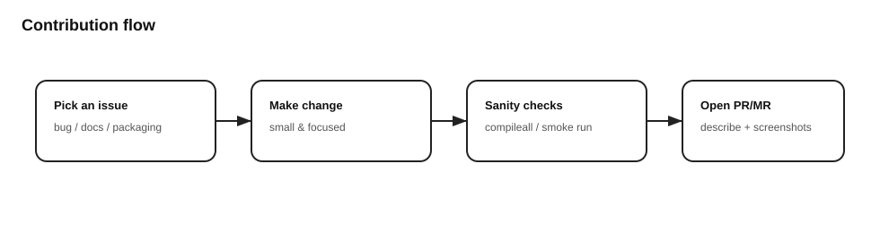

# Contributing

## What to contribute
- Bug fixes and small improvements
- Documentation improvements
- Release/packaging refinements

## Pull request checklist
- Keep changes focused.
- Run basic sanity checks.
- Update docs if behavior changes.

