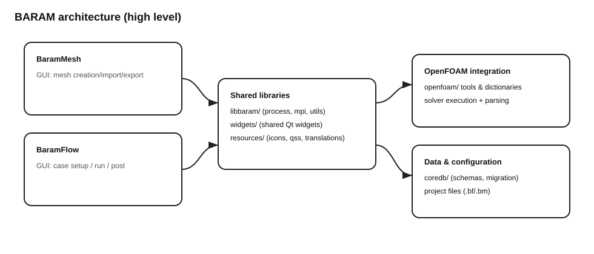
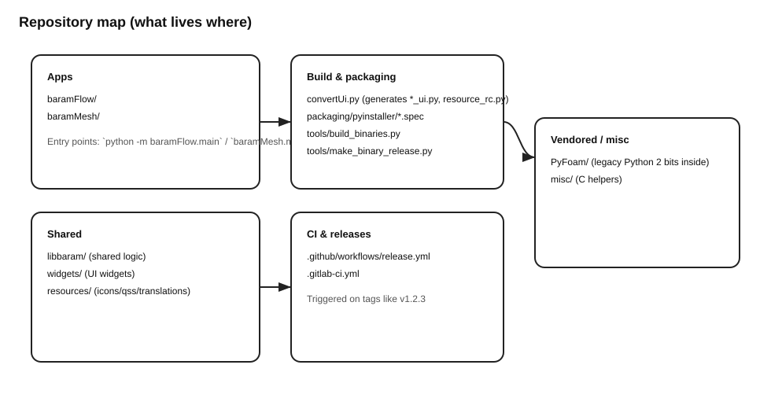

# BARAM Documentation

This site contains **tutorials**, **how-to guides**, **explanations**, and **reference** documentation for:
- **Users** running BaramFlow/BaramMesh
- **Developers** working on the codebase
- **Contributors** sending patches and managing releases

## Quick links
- User: start at **User → Overview**
- Developer: start at **Developer → Overview**
- Contributor: start at **Contributor → Contributing**

## High-level picture

## Repo map

