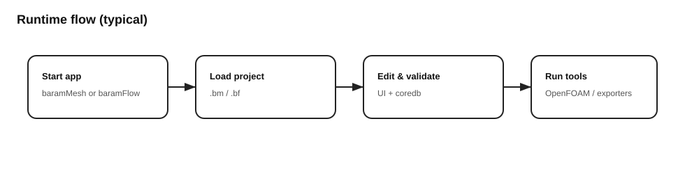

# User Overview

BARAM is a free, open-source GUI for CFD (Computational Fluid Dynamics)
simulation built on OpenFOAM.  It provides two integrated applications:

- **BaramMesh** — geometry import, mesh generation, and export
- **BaramFlow** — case setup, solver execution, and post-processing

## Supported Geometry Formats

| Format | Extensions | Description |
|--------|-----------|-------------|
| STL | `.stl` | Standard tessellation language (binary/ASCII) |
| STEP | `.step`, `.stp` | ISO 10303 CAD interchange *(requires gmsh)* |
| IGES | `.iges`, `.igs` | Initial Graphics Exchange *(requires gmsh)* |
| BREP | `.brep`, `.brp` | OpenCascade boundary representation *(requires gmsh)* |
| Primitives | — | Hex, cylinder, sphere, hex6 (built-in) |

See the [Geometry Import Guide](geometry-import.md) for detailed instructions.

## What You Need

- Python 3.11+ environment with dependencies (`pip install -r requirements.txt`)
- OpenFOAM runtime (see [Installation](https://baramcfd.org/docs/installation/))
- *Optional*: `pip install gmsh` for STEP/IGES/BREP support

## App Startup

From the repository root:

```bash
# BaramMesh
python -m baramMesh.main

# BaramFlow
python -m baramFlow.main
```

Windows convenience scripts:
```powershell
./baramMesh.ps1
./baramFlow.ps1
```

## First-Time Setup (Windows)

1. Run `./bootstrap-dev.ps1` to create `./venv`, install dependencies,
   and generate Qt resources.
2. In VS Code, select the Python interpreter from `./venv`.

## Typical Workflow

1. **Import geometry** — STL, STEP, IGES, or BREP files in BaramMesh
2. **Define regions** — set fluid/solid region location points
3. **Configure base grid** — set background mesh resolution
4. **Refine** — castellation, snap, boundary layers
5. **Export** — to BaramFlow project (3D or 2D)
6. **Set up case** — boundary conditions, models, materials in BaramFlow
7. **Run solver** — monitor convergence and residuals
8. **Post-process** — graphics, reports, ParaView integration

## Configuration

BARAM supports enterprise-grade configuration via:

- **Environment variables** — `BARAM_LOG_LEVEL`, `BARAM_CAD_DEFLECTION`, etc.
- **Config file** — `~/.baram/config.yaml`
- **Sensible defaults** — works out of the box

See [Configuration](../developer/configuration.md) for details.


