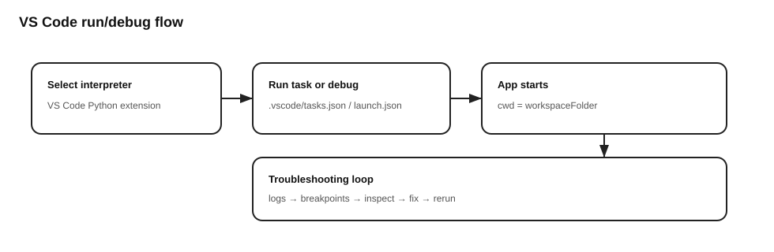

# Tutorials

These are **learning-oriented** walkthroughs.

## Tutorial 1 — Launching the apps
1. Create a virtual environment and install dependencies.
2. Start **BaramMesh**.
3. Start **BaramFlow**.

## Tutorial 2 — Debugging a startup issue
- Run from VS Code using the `baramFlow` / `baramMesh` debug configurations.
- If the app exits early with an MPI warning dialog, confirm MPI availability.

